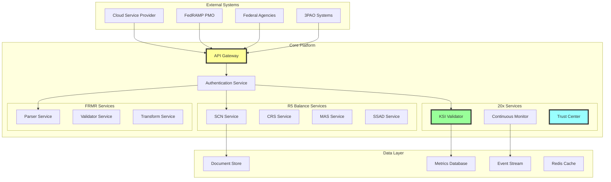
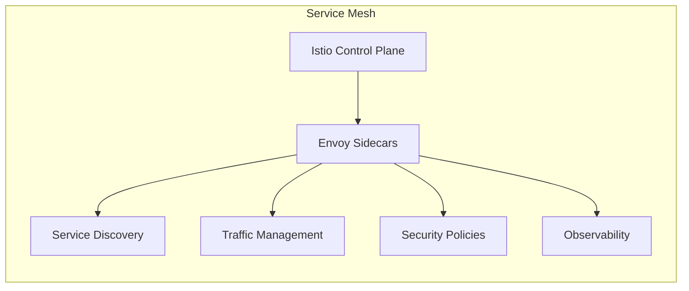
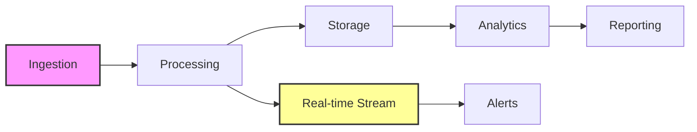
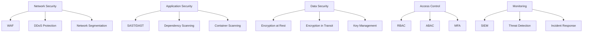
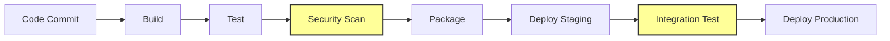
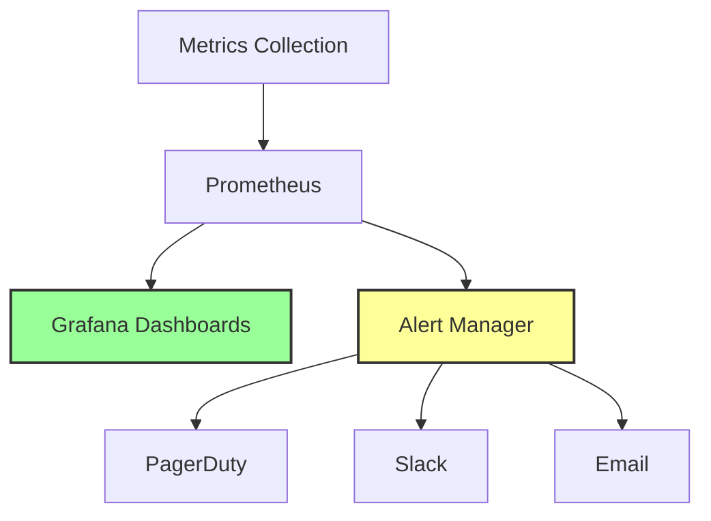

# Architecture Overview

## System Architecture

The FedRAMP R5 Balance & 20x Implementation Suite is designed as a cloud-native, microservices-based architecture that emphasizes scalability, security, and automation.

## High-Level Architecture



## Component Architecture

### 1. API Gateway Layer

**Purpose**: Single entry point for all external interactions

**Components**:
```yaml
api_gateway:
  type: Kong/Envoy
  features:
    - rate_limiting: 1000 req/min
    - authentication: OAuth2/mTLS
    - load_balancing: round-robin
    - circuit_breaker: enabled
    - request_routing: path-based
    - api_versioning: header-based
```

**Key Capabilities**:
- Request routing and load balancing
- Authentication and authorization
- Rate limiting and throttling
- API versioning and deprecation
- Request/response transformation
- Monitoring and analytics

### 2. Service Mesh Architecture



**Implementation**:
- **Service Discovery**: Automatic service registration
- **Load Balancing**: Client-side intelligent routing
- **Circuit Breaking**: Prevent cascade failures
- **Retry Logic**: Automatic retry with backoff
- **Timeouts**: Configurable per-service timeouts
- **mTLS**: Zero-trust service communication

### 3. Microservices Design

#### Core Services

| Service | Responsibility | Technology | Scaling |
|---------|---------------|------------|---------|
| KSI Validator | Validate KSI compliance | Go | Horizontal |
| SCN Manager | Change notifications | Go | Horizontal |
| CRS Reporter | Continuous reporting | Go | Horizontal |
| MAS Assessor | Assessment management | Go | Horizontal |
| SSAD Repository | Document storage | Go | Horizontal |
| FRMR Parser | Document parsing | Go | Horizontal |
| Event Processor | Event streaming | Go | Horizontal |
| Notification Service | Alerts & notifications | Go | Horizontal |

#### Service Communication

```yaml
communication_patterns:
  synchronous:
    protocol: gRPC
    format: Protocol Buffers
    timeout: 30s
    retry: 3 attempts
    
  asynchronous:
    broker: Kafka/NATS
    format: CloudEvents
    delivery: at-least-once
    ordering: partition-based
```

### 4. Data Architecture

#### Data Flow



#### Storage Strategy

| Data Type | Storage | Retention | Backup |
|-----------|---------|-----------|--------|
| Documents | S3/Blob | 7 years | Daily |
| Metrics | TimescaleDB | 3 years | Hourly |
| Events | Kafka | 30 days | Continuous |
| Configs | etcd | Forever | Real-time |
| Cache | Redis | 24 hours | None |
| Logs | Elasticsearch | 1 year | Daily |

### 5. Security Architecture

#### Defense in Depth



#### Zero Trust Implementation

1. **Never Trust, Always Verify**
   - All requests authenticated
   - All connections encrypted
   - Least privilege access

2. **Microsegmentation**
   - Service-level network policies
   - East-west traffic inspection
   - Workload identity

3. **Continuous Verification**
   - Runtime behavior analysis
   - Anomaly detection
   - Adaptive policies

### 6. Deployment Architecture

#### Kubernetes Architecture

```yaml
kubernetes:
  clusters:
    - name: production
      regions: [us-east-1, us-west-2]
      nodes: 20-100 (auto-scaling)
      
  namespaces:
    - fedramp-core
    - fedramp-r5
    - fedramp-20x
    - fedramp-frmr
    
  resources:
    cpu_requests: 100m-2000m
    memory_requests: 256Mi-4Gi
    replicas: 3-50 (HPA)
    
  storage:
    persistent_volumes: EBS/Azure Disk
    storage_classes: [fast-ssd, standard]
```

#### CI/CD Pipeline



### 7. Integration Architecture

#### External Integrations

```yaml
integrations:
  cloud_providers:
    aws:
      - service: CloudTrail
        purpose: Audit logs
        protocol: API
      - service: Config
        purpose: Configuration compliance
        protocol: API
        
    azure:
      - service: Monitor
        purpose: Metrics collection
        protocol: API
      - service: Sentinel
        purpose: Security events
        protocol: Event Hub
        
    gcp:
      - service: Cloud Logging
        purpose: Log aggregation
        protocol: API
      - service: Security Command Center
        purpose: Security findings
        protocol: API
        
  fedramp:
    - service: FedRAMP API
      purpose: Authorization updates
      protocol: REST
    - service: Document Repository
      purpose: Template access
      protocol: HTTPS
```

### 8. Monitoring and Observability

#### Three Pillars of Observability

1. **Metrics**
   ```yaml
   metrics:
     system:
       - cpu_usage
       - memory_usage
       - disk_io
       - network_throughput
     application:
       - request_rate
       - error_rate
       - response_time
       - queue_depth
     business:
       - ksi_validation_rate
       - compliance_score
       - authorization_time
       - cost_per_assessment
   ```

2. **Logging**
   ```yaml
   logging:
     structured: JSON format
     correlation: Trace ID
     levels: [DEBUG, INFO, WARN, ERROR]
     retention: 1 year
     search: Elasticsearch
   ```

3. **Tracing**
   ```yaml
   tracing:
     implementation: OpenTelemetry
     sampling: 1% (adaptive)
     storage: Jaeger
     retention: 30 days
   ```

#### Dashboards and Alerts



### 9. Scalability Design

#### Horizontal Scaling

- **Stateless Services**: All services designed stateless
- **Auto-scaling**: Based on CPU, memory, and custom metrics
- **Load Distribution**: Intelligent routing with health checks
- **Database Sharding**: Partition by tenant/service

#### Performance Optimization

1. **Caching Strategy**
   - Redis for session data
   - CDN for static assets
   - Application-level caching
   - Database query caching

2. **Async Processing**
   - Event-driven architecture
   - Message queues for heavy operations
   - Batch processing for reports
   - Stream processing for real-time data

### 10. Disaster Recovery

#### DR Strategy

| Component | RPO | RTO | Strategy |
|-----------|-----|-----|----------|
| API Services | 5 min | 15 min | Multi-region active-active |
| Databases | 0 min | 5 min | Synchronous replication |
| Document Store | 15 min | 30 min | Cross-region replication |
| Event Streams | 5 min | 10 min | Multi-zone deployment |

#### Backup and Recovery

```yaml
backup_strategy:
  databases:
    frequency: Continuous
    retention: 30 days
    testing: Weekly
    
  documents:
    frequency: Hourly
    retention: 7 years
    testing: Monthly
    
  configurations:
    frequency: On change
    retention: Forever
    testing: Quarterly
```

## Technology Stack

### Core Technologies

| Layer | Technology | Purpose |
|-------|------------|---------|
| Language | Go 1.19+ | Service implementation |
| API | gRPC/REST | Service communication |
| Message Queue | Kafka/NATS | Event streaming |
| Cache | Redis | Performance optimization |
| Database | PostgreSQL | Relational data |
| Time Series | TimescaleDB | Metrics storage |
| Object Store | S3/Blob | Document storage |
| Search | Elasticsearch | Log analysis |
| Container | Docker | Application packaging |
| Orchestration | Kubernetes | Container management |
| Service Mesh | Istio | Service communication |
| Monitoring | Prometheus | Metrics collection |
| Tracing | Jaeger | Distributed tracing |
| CI/CD | GitLab/GitHub Actions | Automation |

## Conclusion

This architecture provides a robust, scalable, and secure foundation for FedRAMP compliance automation. The microservices design enables independent scaling and deployment, while the service mesh provides security and observability. The event-driven architecture ensures real-time compliance monitoring, and the cloud-native design supports multi-cloud deployment strategies.

---

*"Architecture is not just about technology choices, but about enabling business outcomes through technical excellence."* 