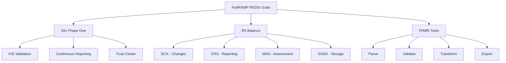

# Executive Summary

## FedRAMP R5 Balance & 20x Implementation Suite

### Overview

This implementation provides a comprehensive toolkit for FedRAMP's modernization initiatives, including the R5 Balance Improvement Releases (BIRs) and the FedRAMP 20x Phase One pilot program. The suite enables automated security assessments, continuous monitoring, and machine-readable compliance documentation aligned with FedRAMP's vision for streamlined cloud authorizations.

### Key Achievements

#### 🚀 FedRAMP 20x Phase One Support
- **Complete Key Security Indicators (KSI) Framework**: All 11 official KSIs with 51 sub-requirements
- **Automated Validation**: Machine-readable assessments with evidence-based scoring
- **Continuous Reporting**: Real-time security metrics and automated monitoring
- **3PAO Integration**: Built-in support for third-party attestation

#### 📊 R5 Balance Implementations
- **R5.SCN**: Automated significant change classification and notification
- **R5.CRS**: Continuous reporting with standardized security metrics
- **R5.MAS**: Minimum assessment standard with evidence management
- **R5.SSAD**: Secure document storage and sharing capabilities

#### 🔧 FRMR Tools Suite
- Direct integration with official FedRAMP/docs repository
- Document parsing, validation, and transformation
- Evidence template generation
- Multi-format export capabilities

### Business Value

#### For Cloud Service Providers (CSPs)
- **Reduced Time to Authorization**: Automated assessments accelerate the approval process
- **Lower Compliance Costs**: Machine-readable formats eliminate manual documentation
- **Continuous Compliance**: Real-time monitoring prevents authorization drift
- **Clear Requirements**: KSI framework simplifies security implementation

#### For 3PAOs
- **Standardized Assessments**: Consistent evaluation criteria across all CSPs
- **Automated Evidence Collection**: Reduced manual review burden
- **Audit Trail**: Complete documentation of assessment activities
- **Efficiency Gains**: Focus on security analysis rather than paperwork

#### For Federal Agencies
- **Risk Transparency**: Real-time visibility into security posture
- **Consistent Baselines**: Standardized security across all cloud services
- **Automated Monitoring**: Continuous assurance without manual oversight
- **Rapid Authorization**: Faster deployment of mission-critical services

### Technical Highlights



### Compliance Alignment

The implementation directly addresses:
- **FedRAMP Authorization Act** requirements for automated assessments
- **NIST SP 800-53** control implementation and validation
- **FedRAMP Continuous Monitoring Performance Management Guide**
- **OMB Memoranda** on cloud security and zero trust

### Implementation Status

| Component | Status | Coverage | Testing |
|-----------|--------|----------|---------|
| KSI Framework | ✅ Complete | 100% (11/11 KSIs) | ✅ Validated |
| SCN Implementation | ✅ Complete | Full RFC-0007 | ✅ Tested |
| CRS Metrics | ✅ Complete | 6 Core Metrics | ✅ Operational |
| MAS Framework | ✅ Complete | All Assessment Types | ✅ Verified |
| SSAD Repository | ✅ Complete | Full Document Set | ✅ Functional |
| FRMR Tools | ✅ Complete | All Operations | ✅ Tested |

### Getting Started

```bash
# Install the toolkit
go get github.com/gocomply/fedramp

# Run your first KSI validation
gocomply_fedramp ksi validate CSO-EXAMPLE-001

# Generate a continuous monitoring report
gocomply_fedramp crs report --output monthly-report.json
```

### Next Steps

1. **Review the [Quick Start Guide](../02-getting-started/quick-start.md)** for immediate deployment
2. **Explore [Use Cases](../10-use-cases/README.md)** for your specific role
3. **Check [Integration Guides](../09-integration/README.md)** for tool connectivity
4. **Join the [FedRAMP Community](https://github.com/FedRAMP/community/discussions)** for support

### Support and Resources

- **Documentation**: Comprehensive guides for all features
- **Examples**: Real-world implementation scenarios
- **API Reference**: Complete programmatic interface documentation
- **Community**: Active development and support channels

---

*This implementation represents a significant step forward in FedRAMP's modernization journey, enabling faster, more secure, and more efficient cloud authorizations for the federal government.* 