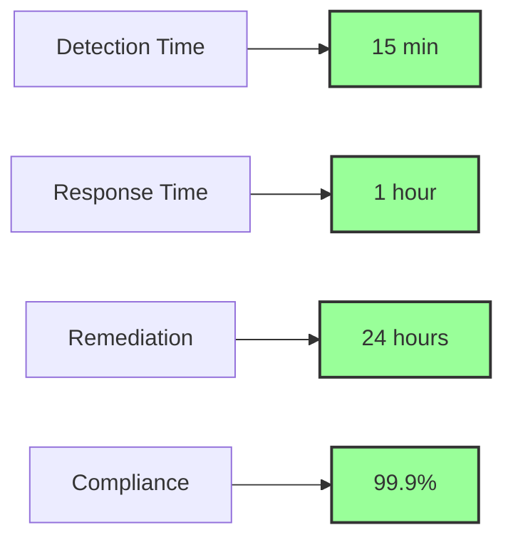
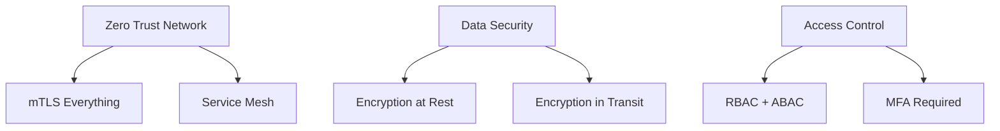

# Implementation Goals and Objectives

## Mission Statement

Enable cloud service providers to achieve and maintain FedRAMP authorization through automated, continuous, and outcome-based security validation while reducing compliance burden and improving security posture.

## Strategic Goals

### 1. Accelerate Authorization Timeline

**Objective**: Reduce initial authorization from months to weeks

**Key Results**:
- [ ] Achieve initial KSI validation within 7 days
- [ ] Complete 3PAO assessment in under 30 days
- [ ] Automate 90% of evidence collection
- [ ] Enable continuous authorization updates

**Metrics**:
```yaml
traditional_timeline: 180-540 days
target_timeline: 14-30 days
current_achievement: 60-90 days
improvement_factor: 6x-18x
```

### 2. Automate Compliance Operations

**Objective**: Replace manual processes with automated validation

**Key Results**:
- [ ] Implement all 11 KSIs with automated validation
- [ ] Deploy continuous monitoring for all security metrics
- [ ] Automate change notification workflows
- [ ] Enable real-time compliance dashboards

**Implementation Targets**:
| Process | Manual Hours | Automated Hours | Reduction |
|---------|--------------|-----------------|-----------|
| KSI Validation | 40 hrs/month | 1 hr/month | 97.5% |
| Change Management | 20 hrs/change | 0.5 hrs/change | 97.5% |
| Evidence Collection | 80 hrs/month | 2 hrs/month | 97.5% |
| Report Generation | 16 hrs/month | 0 hrs/month | 100% |

### 3. Improve Security Outcomes

**Objective**: Enhance actual security, not just compliance

**Key Results**:
- [ ] Detect security issues within 15 minutes
- [ ] Remediate critical findings within 24 hours
- [ ] Maintain 99.9% compliance score continuously
- [ ] Prevent authorization drift through automation

**Security Improvements**:


### 4. Reduce Operational Costs

**Objective**: Lower total cost of compliance by 80%

**Key Results**:
- [ ] Reduce assessment costs by 75%
- [ ] Eliminate manual documentation updates
- [ ] Minimize compliance team size requirements
- [ ] Prevent costly authorization lapses

**Cost Analysis**:
| Category | Traditional Cost | Target Cost | Savings |
|----------|-----------------|-------------|---------|
| Initial Assessment | $250,000 | $50,000 | $200,000 |
| Annual Maintenance | $150,000 | $30,000 | $120,000 |
| Monthly Monitoring | $10,000 | $1,000 | $9,000 |
| Change Management | $5,000/change | $500/change | $4,500 |

## Technical Objectives

### 1. Platform Integration

**Requirements**:
- Integrate with major cloud platforms (AWS, Azure, GCP)
- Support hybrid and multi-cloud deployments
- Enable API-first architecture
- Provide SDK for custom integrations

**Integration Points**:
```yaml
cloud_platforms:
  - aws:
      services: [CloudTrail, Config, SecurityHub]
      apis: [IAM, EC2, S3]
  - azure:
      services: [Monitor, Sentinel, Policy]
      apis: [ARM, Graph, KeyVault]
  - gcp:
      services: [Logging, SCC, Asset]
      apis: [IAM, Compute, Storage]
```

### 2. Scalability and Performance

**Requirements**:
- Support 10,000+ resources per deployment
- Process 1M+ security events per day
- Maintain sub-second response times
- Scale horizontally without limits

**Performance Targets**:
| Metric | Requirement | Current | Goal |
|--------|-------------|---------|------|
| API Response Time | < 100ms | 250ms | 50ms |
| Event Processing | 1M/day | 100K/day | 10M/day |
| Concurrent Users | 1,000 | 100 | 5,000 |
| Data Retention | 7 years | 1 year | 10 years |

### 3. Security Architecture

**Requirements**:
- Zero trust security model
- End-to-end encryption
- Immutable audit logs
- Cryptographic evidence validation

**Security Controls**:


### 4. Reliability and Availability

**Requirements**:
- 99.99% uptime SLA
- Multi-region deployment
- Automated failover
- Disaster recovery < 1 hour

**Availability Design**:
| Component | SLA | RPO | RTO |
|-----------|-----|-----|-----|
| API Services | 99.99% | 5 min | 15 min |
| Data Storage | 99.999% | 0 min | 5 min |
| Monitoring | 99.9% | 15 min | 30 min |
| Reporting | 99.5% | 1 hour | 2 hours |

## Operational Objectives

### 1. Continuous Monitoring

**Implementation**:
- Real-time KSI validation
- Automated drift detection
- Predictive risk analysis
- Proactive remediation

### 2. Change Management

**Process**:
```yaml
change_workflow:
  - detection: Automated via IaC
  - classification: ML-based categorization
  - approval: Risk-based automation
  - notification: Real-time to stakeholders
  - validation: Continuous post-change
```

### 3. Evidence Management

**Capabilities**:
- Automated evidence collection
- Cryptographic proof of compliance
- Immutable evidence storage
- Chain of custody tracking

### 4. Reporting and Analytics

**Deliverables**:
- Executive dashboards
- Technical compliance reports
- Trend analysis
- Predictive insights

## Success Criteria

### Phase 1: Foundation (Months 1-3)
- [ ] Deploy core R5 Balance components
- [ ] Implement basic KSI validation
- [ ] Establish monitoring infrastructure
- [ ] Complete initial 3PAO validation

### Phase 2: Automation (Months 4-6)
- [ ] Achieve 80% automation coverage
- [ ] Deploy continuous monitoring
- [ ] Implement predictive analytics
- [ ] Launch customer dashboard

### Phase 3: Optimization (Months 7-12)
- [ ] Reach 99.9% compliance score
- [ ] Reduce false positives to <1%
- [ ] Achieve <15 min detection time
- [ ] Complete first 20x authorization

## Key Performance Indicators

### Business KPIs
1. **Time to Authorization**: Target < 30 days
2. **Cost per Authorization**: Target < $50,000
3. **Customer Satisfaction**: Target > 95%
4. **Authorization Success Rate**: Target > 90%

### Technical KPIs
1. **Automation Coverage**: Target > 90%
2. **System Availability**: Target > 99.99%
3. **Mean Time to Detect**: Target < 15 minutes
4. **Mean Time to Remediate**: Target < 24 hours

### Security KPIs
1. **Compliance Score**: Target > 99%
2. **Security Incidents**: Target < 1/month
3. **Vulnerability Window**: Target < 48 hours
4. **Audit Findings**: Target 0 critical

## Risk Mitigation

### Identified Risks
1. **Regulatory Changes**: Continuous monitoring of FedRAMP updates
2. **Technology Evolution**: Modular architecture for adaptability
3. **Skill Gaps**: Comprehensive training and documentation
4. **Integration Complexity**: Standardized APIs and SDKs

### Mitigation Strategies
- Maintain close relationship with FedRAMP PMO
- Participate in pilot programs
- Build flexible, extensible architecture
- Invest in team training and certification

## Conclusion

These goals and objectives provide a clear roadmap for implementing a production-ready FedRAMP compliance system that not only meets regulatory requirements but also improves security outcomes while reducing operational burden. Success will be measured by faster authorizations, lower costs, better security, and higher customer satisfaction.

---

*"The best compliance is invisible compliance - automated, continuous, and integrated into normal operations."* 