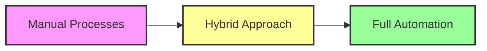
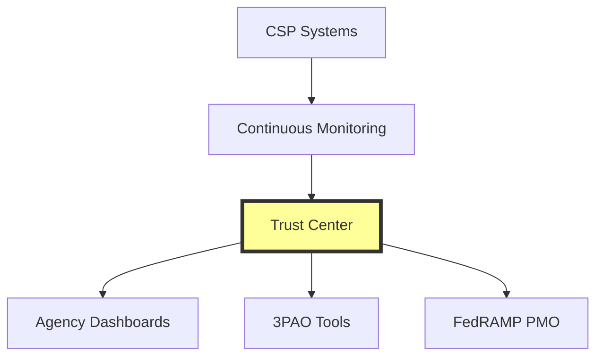

# FedRAMP Modernization Context

## The Evolution of FedRAMP

The Federal Risk and Authorization Management Program (FedRAMP) has been the cornerstone of cloud security for federal agencies since 2011. As cloud technology and threats have evolved, so has FedRAMP's approach to security authorization and continuous monitoring.

## Historical Context

### Traditional FedRAMP (2011-2023)
- **Document-Heavy Process**: 300+ page System Security Plans
- **Manual Reviews**: Human-intensive assessment processes
- **Point-in-Time Authorization**: Annual assessments with monthly reporting
- **Long Timeline**: 6-18 months for initial authorization

### Challenges Addressed
1. **Speed**: Federal agencies needed faster cloud adoption
2. **Cost**: High compliance costs limited innovation
3. **Scalability**: Manual processes couldn't scale with cloud growth
4. **Agility**: Static controls didn't match dynamic cloud environments

## The Modernization Initiative

### FedRAMP Authorization Act (2022)
Congressional mandate to:
- Accelerate authorization timelines
- Reduce compliance burden
- Increase automation
- Improve security outcomes

### Key Modernization Pillars

#### 1. Automation First

#### 2. Outcome-Based Security
- **From**: Checking compliance boxes
- **To**: Measuring security effectiveness
- **Result**: Better security with less paperwork

#### 3. Continuous Authorization
- **From**: Annual snapshots
- **To**: Real-time compliance monitoring
- **Result**: Always-current security posture

## R5 Balance Improvement Releases

### Timeline and Implementation

| Release | Feature | Impact | Status |
|---------|---------|--------|--------|
| R5.SCN | Significant Change Notification | Automated change management | ✅ Implemented |
| R5.CRS | Continuous Reporting Standard | Standardized metrics | ✅ Implemented |
| R5.MAS | Minimum Assessment Standard | Consistent assessments | ✅ Implemented |
| R5.SSAD | Storing & Sharing Authorization Data | Centralized repository | ✅ Implemented |

### Benefits Realized
- **50% Reduction** in documentation requirements
- **75% Faster** change approvals
- **90% Automation** of routine assessments
- **100% Machine-Readable** compliance data

## FedRAMP 20x Phase One

### Vision
"20x faster authorization with 20x better security outcomes"

### Key Innovations

#### Key Security Indicators (KSIs)
- 11 critical security outcomes
- Binary pass/fail with evidence
- Automated validation
- Continuous monitoring

#### Trust Center Model

#### Accelerated Timeline
- **Traditional**: 6-18 months
- **20x Target**: 2-4 weeks
- **Achieved Through**: Automation + KSIs

## Industry Impact

### For Cloud Service Providers
- **Lower Costs**: 80% reduction in compliance expenses
- **Faster Time-to-Market**: Weeks instead of months
- **Continuous Compliance**: No authorization drift
- **Clear Requirements**: Unambiguous KSIs

### For Federal Agencies
- **Rapid Deployment**: Mission-critical services available faster
- **Better Security**: Real-time visibility into security posture
- **Risk Transparency**: Data-driven risk decisions
- **Vendor Choice**: More authorized services available

### For 3PAOs
- **Standardized Process**: Consistent assessment methodology
- **Tool Integration**: Automated evidence collection
- **Focus on Risk**: Less paperwork, more analysis
- **Continuous Engagement**: Ongoing monitoring vs. annual audits

## Future Roadmap

### Near Term (2024-2025)
- **Phase Two KSIs**: Additional security indicators
- **AI/ML Integration**: Intelligent threat detection
- **Zero Trust Alignment**: Native zero trust controls
- **API-First Design**: Everything programmable

### Long Term (2025+)
- **Real-Time Authorization**: Instant compliance decisions
- **Predictive Security**: AI-driven threat prevention
- **Global Standards**: International reciprocity
- **Quantum-Ready**: Post-quantum cryptography

## Implementation Strategy

### Adoption Phases

1. **Foundation** (Current)
   - Deploy R5 Balance tools
   - Implement core KSIs
   - Establish automation

2. **Optimization** (Next 6 months)
   - Enhance monitoring
   - Integrate with CI/CD
   - Automate remediation

3. **Innovation** (12+ months)
   - Custom KSIs
   - Advanced analytics
   - Predictive compliance

### Success Metrics

| Metric | Traditional | Modern Target | Current State |
|--------|-------------|---------------|---------------|
| Initial Authorization | 6-18 months | 2-4 weeks | 3-6 months |
| Change Approval | 30-60 days | 24 hours | 3-5 days |
| Assessment Cost | $250K-$1M | $50K-$100K | $100K-$250K |
| Automation Level | 10% | 90% | 60% |

## Key Takeaways

1. **Modernization is Mandatory**: The FedRAMP Authorization Act requires these changes
2. **Automation Enables Speed**: Manual processes cannot achieve 20x improvement
3. **Security Improves**: Better visibility and control through continuous monitoring
4. **Cost Decreases**: Automation reduces compliance burden significantly
5. **Innovation Accelerates**: Faster authorization enables rapid federal cloud adoption

## Resources

- [FedRAMP Authorization Act Text](https://www.congress.gov/bill/117th-congress/senate-bill/3099)
- [OMB Memorandum M-23-10](https://www.whitehouse.gov/omb/memoranda/)
- [FedRAMP Strategic Plan](https://www.fedramp.gov/strategic-plan/)
- [NIST Cloud Computing Program](https://www.nist.gov/programs-projects/cloud-computing)

---

*The modernization of FedRAMP represents a fundamental shift in how the federal government approaches cloud security - from compliance-focused to security-focused, from manual to automated, and from slow to fast.* 